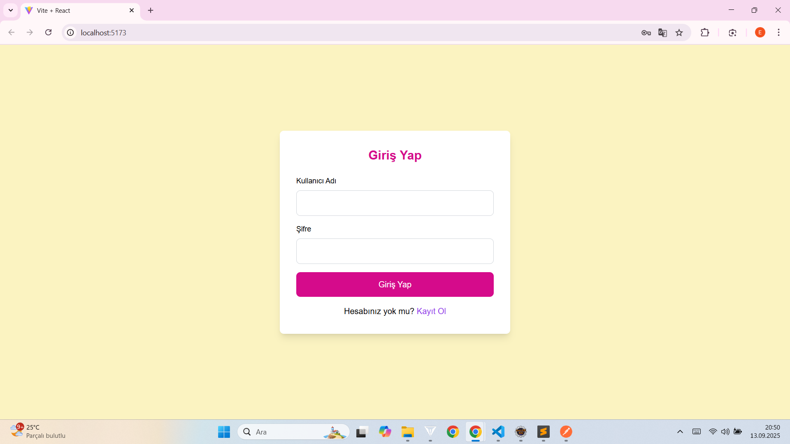
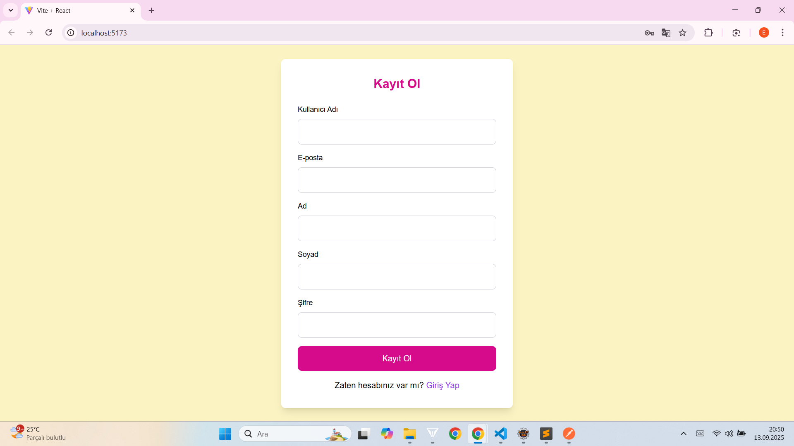
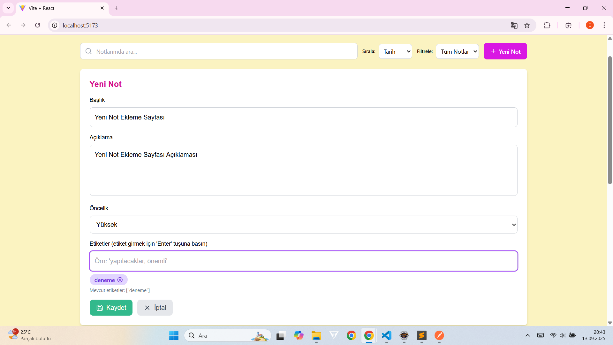
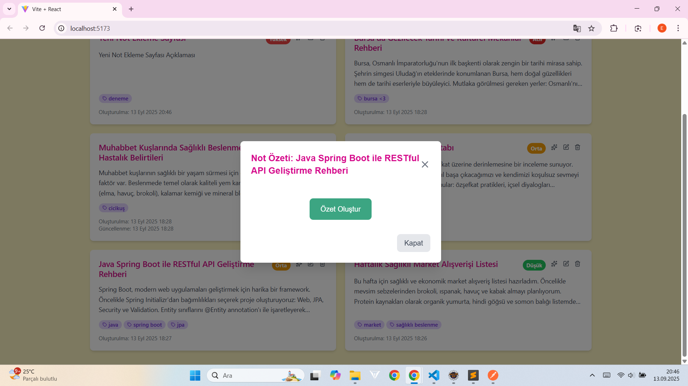
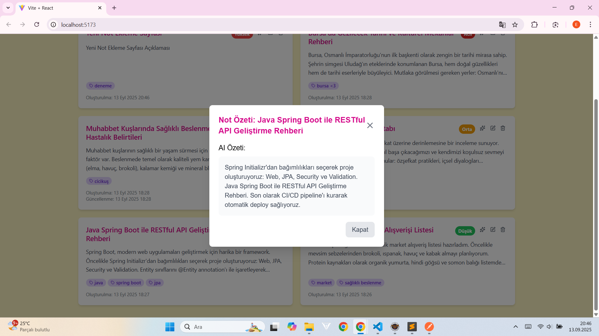
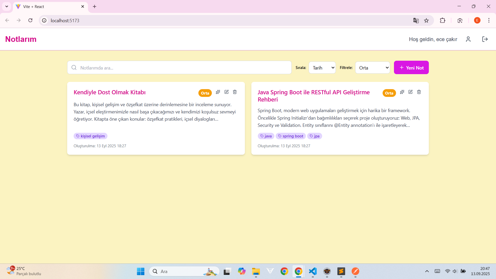
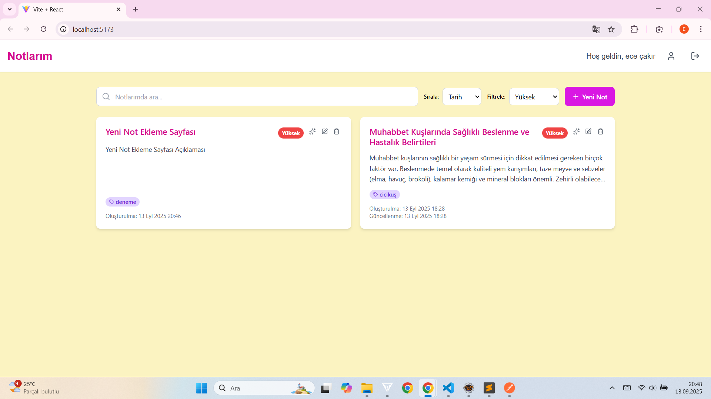
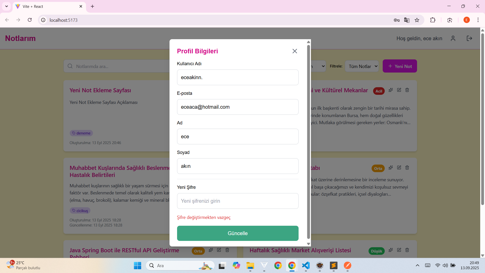

# NoteApp - Akıllı Not Yönetim Sistemi


Modern ve kullanıcı dostu bir not yönetim uygulaması. AI destekli özetleme, etiket yönetimi ve öncelik sistemi ile notlarınızı daha verimli yönetin.


## 📸 Ekran Görüntüleri

### Ana Arayüz


### Kimlik Doğrulama



### Not İşlemleri


### AI Özetleme



### Öncelik Filtreleme



### Profil Yönetimi



## ✨ Öne Çıkan Özellikler

- 🤖 **AI Destekli Özetleme** - Hugging Face BART-large-CNN modeli ile otomatik not özetleme
- 🏷️ **Akıllı Etiket Sistemi** - Notları kategorilere göre düzenleme
- ⚡ **Öncelik Yönetimi** - Acil, yüksek, orta ve düşük öncelik seviyeleri
- 🔐 **Güvenli Kimlik Doğrulama** - JWT tabanlı güvenlik sistemi
- 📱 **Responsive Tasarım** - Mobil ve masaüstü uyumlu React arayüz
- 🔍 **Gelişmiş Arama** - Başlık ve etiketlere göre filtreleme

## 🛠️ Teknoloji Stack'i

### Backend
- **Java 17+** - Temel programlama dili
- **Spring Boot 3.2+** - Web framework
- **Spring Security** - Kimlik doğrulama ve yetkilendirme
- **Spring Data JPA** - Veritabanı erişim katmanı
- **Spring Web** - RESTful API'ler oluşturmak için
- **PostgreSQL** - İlişkisel veritabanı
- **Hibernate** - JPA implementasyonu olarak ORM (Object-Relational Mapping) aracı.
- **ModelMapper** - DTO (Data Transfer Object) ve entity nesneleri arasında eşleme yapmak için.
- **Lombok** - Boilerplate kod azaltma
- **Maven** - Bağımlılık yönetimi

### Frontend
- **React 18+** - Kullanıcı arayüzü
- **Vite** - Build tool ve development server
- **Tailwind CSS** - Styling framework
- **Lucide React** - İkon kütüphanesi
- **Axios** - HTTP istemcisi

## 🏗️ Mimari Yapı

Proje katmanlı mimari ve MVC pattern'ine uygun olarak geliştirilmiştir:

```
src/
├── main/java/com/eceakin/noteapp/
│   ├── application/      # Business logic katmanı
│   ├── config/          # Konfigürasyon sınıfları
│   ├── controller/      # REST controller'lar
│   ├── dto/            # Data Transfer Object'ler
│   ├── entity/         # JPA Entity sınıfları
│   ├── repository/     # Data access katmanı
│   ├── security/       # Güvenlik konfigürasyonları
│   ├── service/        # Service interface'leri
│   ├── shared/         # Ortak utilities
│   └── rules/          # Özel business kuralları
```

## 📋 API Endpoints

### Kimlik Doğrulama Endpoints

| Method | Endpoint | Açıklama |
|--------|----------|----------|
| `POST` | `/api/auth/login` | Kullanıcı girişi |
| `POST` | `/api/auth/register` | Kullanıcı kaydı |

### Not Yönetimi Endpoints

| Method | Endpoint | Açıklama |
|--------|----------|----------|
| `GET` | `/api/notes` | Tüm notları getir |
| `GET` | `/api/notes/{id}` | ID'ye göre not getir |
| `POST` | `/api/notes` | Yeni not oluştur |
| `PUT` | `/api/notes/{id}` | Not güncelle |
| `DELETE` | `/api/notes/{id}` | Not sil |
| `POST` | `/api/notes/{id}/summarize` | Notu özetle |
| `GET` | `/api/notes/search?query={}` | Notlarda arama |
| `GET` | `/api/notes/by-priority?priority={}` | Önceliğe göre filtrele |

### Kullanıcı Endpoints

| Method | Endpoint | Açıklama |
|--------|----------|----------|
| `GET` | `/api/users/me` | Mevcut kullanıcı bilgileri |
| `PUT` | `/api/users/me` | Kullanıcı bilgilerini güncelle |

## 🚀 Kurulum ve Çalıştırma

### Backend Kurulumu

1. Repository'yi klonlayın:
```bash
git clone https://github.com/your-username/noteapp.git
cd noteapp
```

2. PostgreSQL veritabanı oluşturun:
```sql
CREATE DATABASE noteapp;
```

3. application.properties dosyasını düzenleyin:
```properties
spring.datasource.url=jdbc:postgresql://localhost:5432/noteapp
spring.datasource.username=your-username
spring.datasource.password=your-password
spring.jpa.hibernate.ddl-auto=update

# Hugging Face API Configuration
huggingface.api.url=https://api-inference.huggingface.co/models/facebook/bart-large-cnn
huggingface.api.token=your-huggingface-token
```

4. Projeyi build edin ve çalıştırın:
```bash
mvn clean install
mvn spring-boot:run
```

### Frontend Kurulumu

1. Frontend dizinine gidin:
```bash
cd frontend
```

2. Bağımlılıkları yükleyin:
```bash
npm install
```

3. Development server'ı başlatın:
```bash
npm run dev
```


## 🤖 AI Özetleme Özelliği

Uygulama, Hugging Face'in BART-large-CNN modelini kullanarak otomatik not özetleme özelliği sunar:

# 📮 Postman Collection

## API Testleri için Postman Collection

Aşağıdaki JSON'ı Postman'e import ederek tüm API endpoint'lerini kolayca test edebilirsiniz:

```json
{
  "info": {
    "name": "Note App API",
    "description": "API for managing notes and users",
    "schema": "https://schema.getpostman.com/json/collection/v2.1.0/collection.json"
  },
  "variable": [
    {
      "key": "baseUrl",
      "value": "http://localhost:8080",
      "type": "string"
    },
    {
      "key": "authToken",
      "value": "",
      "type": "string"
    }
  ],
  "item": [
    {
      "name": "Authentication",
      "item": [
        {
          "name": "Register",
          "request": {
            "method": "POST",
            "header": [
              {
                "key": "Content-Type",
                "value": "application/json"
              }
            ],
            "body": {
              "mode": "raw",
              "raw": "{\n  \"username\": \"testuser\",\n  \"email\": \"test@example.com\",\n  \"password\": \"password123\",\n  \"firstName\": \"Test\",\n  \"lastName\": \"User\"\n}"
            },
            "url": {
              "raw": "{{baseUrl}}/api/auth/register",
              "host": ["{{baseUrl}}"],
              "path": ["api", "auth", "register"]
            }
          },
          "response": []
        },
        {
          "name": "Login",
          "request": {
            "method": "POST",
            "header": [
              {
                "key": "Content-Type",
                "value": "application/json"
              }
            ],
            "body": {
              "mode": "raw",
              "raw": "{\n  \"username\": \"testuser\",\n  \"password\": \"password123\"\n}"
            },
            "url": {
              "raw": "{{baseUrl}}/api/auth/login",
              "host": ["{{baseUrl}}"],
              "path": ["api", "auth", "login"]
            }
          },
          "response": [],
          "event": [
            {
              "listen": "test",
              "script": {
                "exec": [
                  "// Extract token from response and set as environment variable",
                  "var jsonData = pm.response.json();",
                  "pm.collectionVariables.set(\"authToken\", jsonData.token);",
                  "pm.collectionVariables.set(\"userId\", jsonData.id);"
                ],
                "type": "text/javascript"
              }
            }
          ]
        }
      ]
    },
    {
      "name": "Notes",
      "item": [
        {
          "name": "Create Note",
          "request": {
            "method": "POST",
            "header": [
              {
                "key": "Content-Type",
                "value": "application/json"
              },
              {
                "key": "Authorization",
                "value": "Bearer {{authToken}}"
              }
            ],
            "body": {
              "mode": "raw",
              "raw": "{\n  \"title\": \"My First Note\",\n  \"description\": \"This is the content of my first note\",\n  \"tags\": [\"important\", \"work\"],\n  \"priority\": \"HIGH\"\n}"
            },
            "url": {
              "raw": "{{baseUrl}}/api/notes",
              "host": ["{{baseUrl}}"],
              "path": ["api", "notes"]
            }
          },
          "response": []
        },
        {
          "name": "Get All Notes",
          "request": {
            "method": "GET",
            "header": [
              {
                "key": "Authorization",
                "value": "Bearer {{authToken}}"
              }
            ],
            "url": {
              "raw": "{{baseUrl}}/api/notes",
              "host": ["{{baseUrl}}"],
              "path": ["api", "notes"]
            }
          },
          "response": []
        },
        {
          "name": "Get Note by ID",
          "request": {
            "method": "GET",
            "header": [
              {
                "key": "Authorization",
                "value": "Bearer {{authToken}}"
              }
            ],
            "url": {
              "raw": "{{baseUrl}}/api/notes/1",
              "host": ["{{baseUrl}}"],
              "path": ["api", "notes", "1"]
            }
          },
          "response": []
        },
        {
          "name": "Update Note",
          "request": {
            "method": "PUT",
            "header": [
              {
                "key": "Content-Type",
                "value": "application/json"
              },
              {
                "key": "Authorization",
                "value": "Bearer {{authToken}}"
              }
            ],
            "body": {
              "mode": "raw",
              "raw": "{\n  \"title\": \"Updated Note Title\",\n  \"description\": \"Updated content of my note with AI features\",\n  \"tags\": [\"updated\", \"ai\", \"important\"],\n  \"priority\": \"MEDIUM\"\n}"
            },
            "url": {
              "raw": "{{baseUrl}}/api/notes/1",
              "host": ["{{baseUrl}}"],
              "path": ["api", "notes", "1"]
            }
          },
          "response": []
        },
        {
          "name": "Search Notes",
          "request": {
            "method": "GET",
            "header": [
              {
                "key": "Authorization",
                "value": "Bearer {{authToken}}"
              }
            ],
            "url": {
              "raw": "{{baseUrl}}/api/notes/search?query=AI",
              "host": ["{{baseUrl}}"],
              "path": ["api", "notes", "search"],
              "query": [
                {
                  "key": "query",
                  "value": "AI"
                }
              ]
            }
          },
          "response": []
        },
        {
          "name": "Summarize Note",
          "request": {
            "method": "POST",
            "header": [
              {
                "key": "Authorization",
                "value": "Bearer {{authToken}}"
              }
            ],
            "url": {
              "raw": "{{baseUrl}}/api/notes/1/summarize",
              "host": ["{{baseUrl}}"],
              "path": ["api", "notes", "1", "summarize"]
            }
          },
          "response": []
        },
        {
          "name": "Filter by Priority",
          "request": {
            "method": "GET",
            "header": [
              {
                "key": "Authorization",
                "value": "Bearer {{authToken}}"
              }
            ],
            "url": {
              "raw": "{{baseUrl}}/api/notes/by-priority?priority=HIGH",
              "host": ["{{baseUrl}}"],
              "path": ["api", "notes", "by-priority"],
              "query": [
                {
                  "key": "priority",
                  "value": "HIGH"
                }
              ]
            }
          },
          "response": []
        },
        {
          "name": "Delete Note",
          "request": {
            "method": "DELETE",
            "header": [
              {
                "key": "Authorization",
                "value": "Bearer {{authToken}}"
              }
            ],
            "url": {
              "raw": "{{baseUrl}}/api/notes/1",
              "host": ["{{baseUrl}}"],
              "path": ["api", "notes", "1"]
            }
          },
          "response": []
        }
      ]
    },
    {
      "name": "Users",
      "item": [
        {
          "name": "Get Current User",
          "request": {
            "method": "GET",
            "header": [
              {
                "key": "Authorization",
                "value": "Bearer {{authToken}}"
              }
            ],
            "url": {
              "raw": "{{baseUrl}}/api/users/me",
              "host": ["{{baseUrl}}"],
              "path": ["api", "users", "me"]
            }
          },
          "response": []
        },
        {
          "name": "Update Current User",
          "request": {
            "method": "PUT",
            "header": [
              {
                "key": "Content-Type",
                "value": "application/json"
              },
              {
                "key": "Authorization",
                "value": "Bearer {{authToken}}"
              }
            ],
            "body": {
              "mode": "raw",
              "raw": "{\n  \"username\": \"updateduser\",\n  \"email\": \"updated@example.com\",\n  \"firstName\": \"Updated\",\n  \"lastName\": \"User\"\n}"
            },
            "url": {
              "raw": "{{baseUrl}}/api/users/me",
              "host": ["{{baseUrl}}"],
              "path": ["api", "users", "me"]
            }
          },
          "response": []
        }
      ]
    }
  ]
}
```

## 🚀 Postman Kullanım Talimatları

### 1. Collection'ı Import Etme
1. Postman uygulamasını açın
2. "Import" butonuna tıklayın
3. "Raw text" sekmesine yukarıdaki JSON'u yapıştırın
4. "Import" butonuna tıklayın

### 2. Environment Variables Ayarlama
1. "Environments" sekmesine gidin
2. "Globals" bölümüne aşağıdaki değişkenleri ekleyin:
   - `baseUrl`: `http://localhost:8080`
   - `authToken`: (boş bırakın, login sonrası otomatik dolacak)

### 3. Test Akışı
1. Önce **Register** endpoint'ini çalıştırarak yeni kullanıcı oluşturun
2. **Login** endpoint'ini çalıştırın (token otomatik olarak kaydedilecek)
3. Diğer endpoint'leri sırayla test edin

### 4. Örnek Test Senaryosu

```bash
# 1. Kullanıcı kaydı
POST /api/auth/register
{
  "username": "testuser",
  "email": "test@example.com",
  "password": "password123",
  "firstName": "Test",
  "lastName": "User"
}

# 2. Giriş yap ve token al
POST /api/auth/login
{
  "username": "testuser",
  "password": "password123"
}

# 3. Yeni not oluştur
POST /api/notes
Authorization: Bearer <token>
{
  "title": "AI Özetleme Test",
  "description": "Bu not Hugging Face BART modeli ile özetlenecek...",
  "tags": ["ai", "test", "teknoloji"],
  "priority": "HIGH"
}

# 4. Notu özetle
POST /api/notes/1/summarize
Authorization: Bearer <token>

# 5. Önceliğe göre filtrele
GET /api/notes/by-priority?priority=HIGH
Authorization: Bearer <token>
```

## 🔍 Önemli Notlar

- Tüm note endpoint'leri **JWT token** gerektirir
- Login işleminden sonra token otomatik olarak `authToken` variable'ına kaydedilir
- Örneklerde `priority` değerleri: `HIGH`, `MEDIUM`, `LOW`
- Tags array formatında gönderilmelidir: `["tag1", "tag2"]`

Bu Postman collection'ı ile tüm API endpoint'lerini kolayca test edebilir ve AI özetleme özelliğini deneyebilirsiniz.


## 📄 Lisans

Bu proje MIT lisansı altında lisanslanmıştır. Detaylar için [LICENSE](LICENSE) dosyasına bakın.

## 🤝 Katkıda Bulunma

1. Fork edin
2. Feature branch oluşturun (`git checkout -b feature/AmazingFeature`)
3. Commit edin (`git commit -m 'Add some AmazingFeature'`)
4. Push edin (`git push origin feature/AmazingFeature`)
5. Pull Request oluşturun

## 📞 İletişim

Ece Akın - [@eceakin](https://github.com/eceakin) - eceakin@example.com

Proje Linki: [https://github.com/eceakin/noteapp](https://github.com/eceakin/noteapp)

---

**Not**: Bu proje eğitim amaçlı geliştirilmiştir ve aktif olarak geliştirilmeye devam etmektedir.
